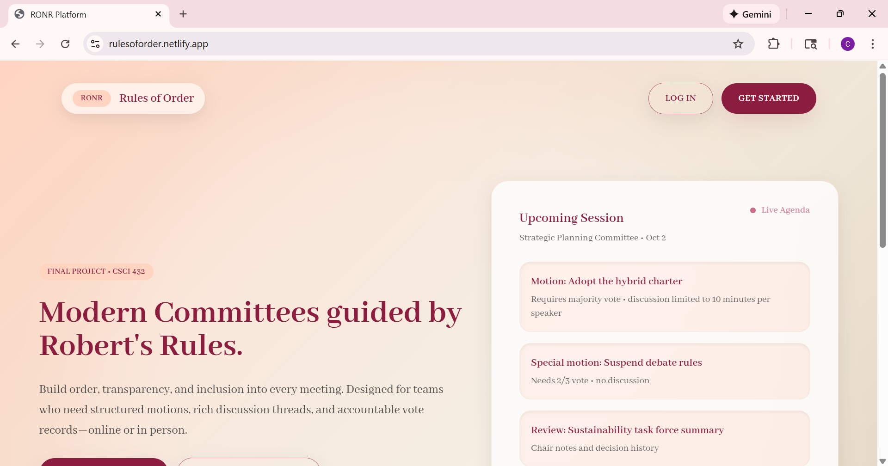
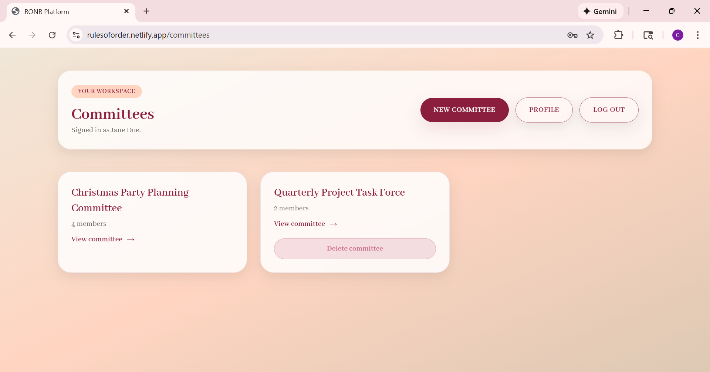
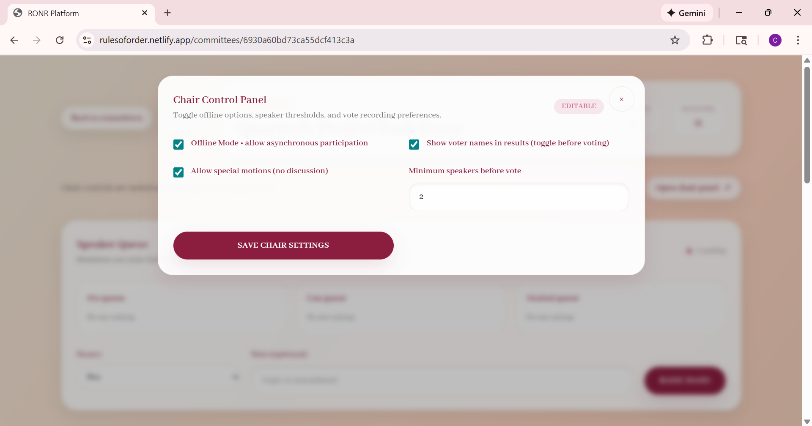
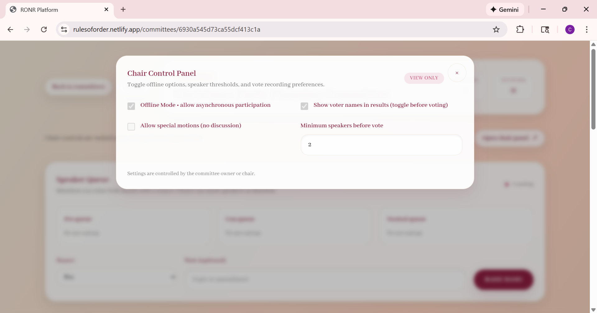
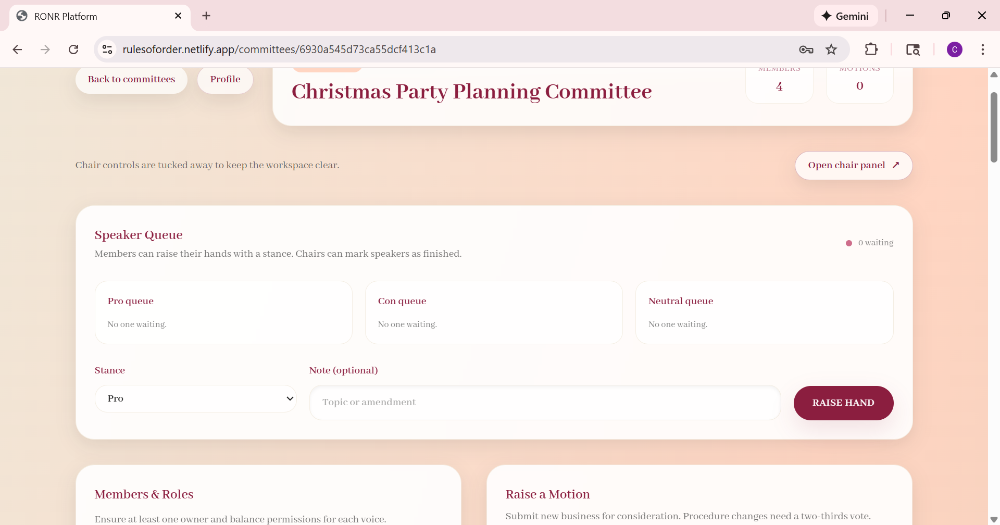
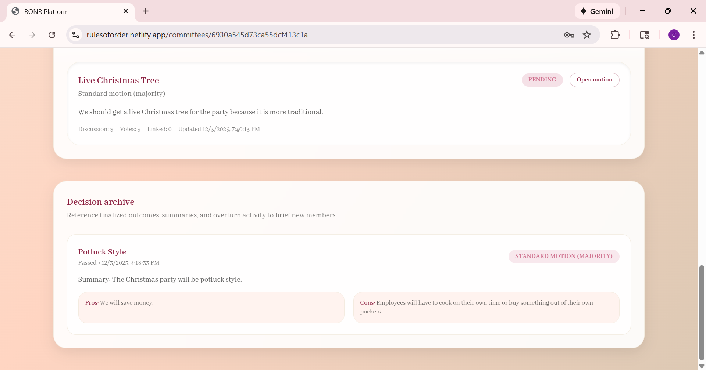
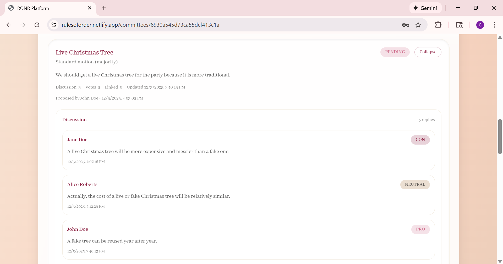
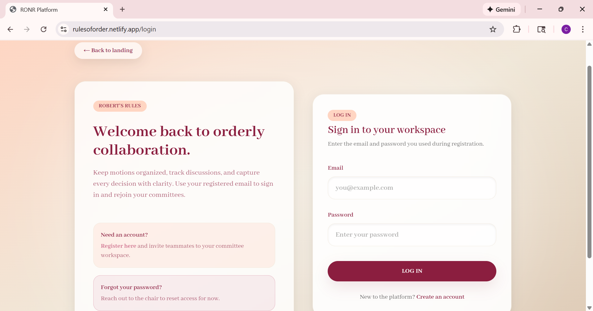
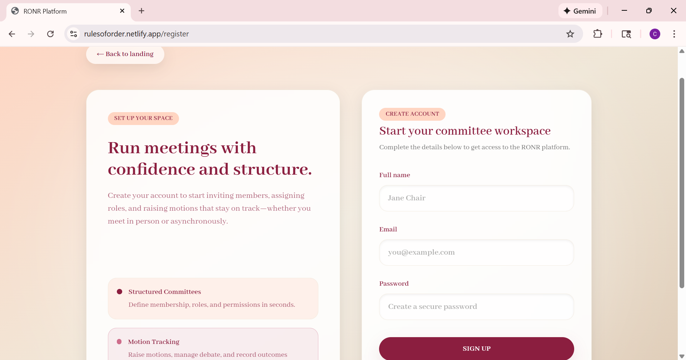
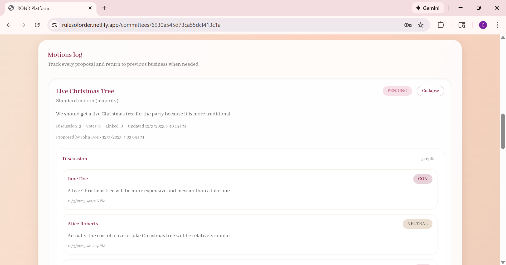

# RONR Platform (React SPA)

Authors: Vedha Navudu, Alice Roberts, Cora Snyder 

## Getting Started

1. Install dependencies (Node 18+)
   ```bash
   npm install
   ```
2. Start Vite dev server
   ```bash
   npm run dev
   ```
3. Open the printed local URL (e.g. http://localhost:5173)
4. (Optional) Copy `.env.example` to `.env` and set `VITE_API_BASE_URL` if your backend runs somewhere other than `http://localhost:5050/api`.

### Backend (Express / MongoDB)

1. Install API dependencies
   ```bash
   cd server
   npm install
   ```
2. Copy the environment template and fill in credentials
   ```bash
   cp .env.example .env
   ```
   - `MONGO_URI`: MongoDB Atlas connection string
   - `JWT_SECRET`: random string for signing auth tokens
   - `FRONTEND_URL`: comma-separated list of allowed origins (e.g. `http://localhost:5173`)
3. Start the API
   ```bash
   npm run dev
   ```
4. The API listens on `http://localhost:5000` by default (configurable via `PORT` in `.env`). The React app will begin integrating with these endpoints next.

## App Structure

- Entry: `index.html` mounts React into `#root`
- Router shell: `src/App.jsx`
- Global state: `src/context/AuthContext.jsx`, `src/utils/storage.js`
- Pages:
  - `src/pages/login.jsx`
  - `src/pages/register.jsx`
  - `src/pages/committee-list.jsx`
  - `src/pages/committee-detail.jsx`
  - `src/pages/committee-create.jsx`

Legacy static HTML pages in the project root are retained for reference but are no longer part of the build.

## Mock Backend & Persistence

- Initial data is seeded from `src/utils/storage.js` the first time the app loads.
- Subsequent interactions persist to `localStorage` under the `appData` key.
- The committee creation form POSTs to `/create-committee`; replace this endpoint once your backend is ready. When the request fails, the committee is still created locally so offline work can continue.

## Current Feature Highlights

- Email/password registration and login with session persistence.
- Committees list with guarded routes for authenticated users.
- Committee creation workflow with role/permission management.
- Motion log on the committee detail page, including support for procedure-changing motions that require supermajority votes.

## Demo & Deployment Checklist

- **Video walkthrough**: _TBD_ – record a short demo covering auth, chair controls, motions, voting, and overturn workflow. (Link placeholder: https://drive.google.com/file/d/1USS_KdqoIDVBIS3NNfDZEo0sqJdbqItN/view?usp=sharing)
- **Hosted site**: https://rulesoforder.netlify.app
- **Screenshots**: 

***Landing***



***Committees Dashboard***



***Chair Control Panel***





***Speaker Queue*** 



***Decision Archive*** 



***Motion Detail Cards***



## Feature Walkthrough

| Area | Highlights |
| --- | --- |
| Authentication | Email/password register + login, guarded routes, session persistence with localStorage seed data. |
| Committee creation | Owner/chair/member/observer roles, granular permissions (`createMotion`, `discussion`, `moveToVote`, `vote`) plus validation for a single owner. |
| Chair control panel | Toggles offline mode, min speakers before vote, whether votes record names, and whether special motions are allowed. Settings persist per committee. |
| Speaker queue | Members raise hands tagged pro/con/neutral with optional notes. Chairs can mark speakers as complete; members can lower their own hands. |
| Motions & sub-motions | Raise standard/procedure/special motions, attach discussion threads, spawn revisions/amendments/postponements, and track variants on the parent card. |
| Voting | Permission-gated ballots prevent duplicates, show tallies + optional voter names, and respect committee settings. |
| Decisions | Chairs record outcomes (passed/failed/postponed) with summary + pros/cons. Decision archive lists historical context for future readers. |
| Overturns | Members who voted “support” on a passed motion can request an overturn; requests are stored as child motions and surfaced in the archive. |

## Documentation Assets

- Landing + marketing copy in `src/pages/landing.jsx`.


- High-fidelity styled auth pages (`login.jsx`, `register.jsx`).

 

- Motion log demonstrates RONR adaptations for asynchronous use.



Add screenshots of each page/workflow above when available to satisfy the report requirement.

## Backend API Documentation

### Overview
The backend is built with Express.js and MongoDB. All endpoints require JWT authentication (except `/api/auth/register` and `/api/auth/login`). The API uses role-based access control (RBAC) with roles: `owner`, `chair`, `member`, and `observer`. Permissions include `createMotion`, `discussion`, `moveToVote`, and `vote`.

### Authentication Endpoints

#### `POST /api/auth/register`
Register a new user.

**Request Body:**
```json
{
  "name": "John Doe",
  "email": "john@example.com",
  "password": "securePassword123"
}
```

**Response (201 Created):**
```json
{
  "user": {
    "id": "user_id",
    "name": "John Doe",
    "email": "john@example.com"
  }
}
```

**Errors:**
- `400`: Name, email, and password are required.
- `409`: Email already registered.

---

#### `POST /api/auth/login`
Authenticate a user and receive a JWT token.

**Request Body:**
```json
{
  "email": "john@example.com",
  "password": "securePassword123"
}
```

**Response (200 OK):**
```json
{
  "user": {
    "id": "user_id",
    "name": "John Doe",
    "email": "john@example.com"
  }
}
```

**Errors:**
- `400`: Email and password are required.
- `401`: Invalid credentials.

---

#### `POST /api/auth/logout`
Clear authentication session.

**Response (200 OK):**
```json
{
  "message": "Logged out."
}
```

---

#### `GET /api/auth/me`
Get the current authenticated user's profile.

**Response (200 OK):**
```json
{
  "user": {
    "id": "user_id",
    "name": "John Doe",
    "email": "john@example.com"
  }
}
```

---

#### `PATCH /api/auth/me`
Update the current user's profile.

**Request Body:**
```json
{
  "name": "Jane Doe"
}
```

**Response (200 OK):**
```json
{
  "user": {
    "id": "user_id",
    "name": "Jane Doe",
    "email": "john@example.com"
  }
}
```

**Errors:**
- `400`: Name is required.

---

### Committee Endpoints

#### `GET /api/committees`
List all committees the current user is a member of.

**Response (200 OK):**
```json
{
  "committees": [
    {
      "_id": "committee_id",
      "name": "Board of Directors",
      "description": "Main board oversight",
      "settings": {
        "offlineMode": true,
        "minSpeakersBeforeVote": 2,
        "recordNamesInVotes": false,
        "allowSpecialMotions": true
      },
      "members": [
        {
          "user": "user_id",
          "name": "John Doe",
          "email": "john@example.com",
          "role": "owner",
          "permissions": ["createMotion", "discussion", "moveToVote", "vote"]
        }
      ],
      "handRaises": [],
      "createdBy": "user_id",
      "createdAt": "2025-12-10T00:00:00Z",
      "updatedAt": "2025-12-10T00:00:00Z"
    }
  ]
}
```

---

#### `POST /api/committees`
Create a new committee.

**Request Body:**
```json
{
  "name": "Board of Directors",
  "description": "Main board oversight",
  "members": [
    {
      "name": "Jane Smith",
      "email": "jane@example.com",
      "role": "chair",
      "permissions": ["createMotion", "discussion", "moveToVote", "vote"]
    }
  ],
  "settings": {
    "offlineMode": true,
    "minSpeakersBeforeVote": 2,
    "recordNamesInVotes": false,
    "allowSpecialMotions": true
  }
}
```

**Response (201 Created):**
Returns the created committee object (see GET response above).

**Errors:**
- `400`: Committee name is required.

---

#### `GET /api/committees/:id`
Retrieve detailed information about a specific committee, including all motions.

**Response (200 OK):**
```json
{
  "committee": {
    "_id": "committee_id",
    "name": "Board of Directors",
    "description": "Main board oversight",
    "settings": { ... },
    "members": [ ... ],
    "handRaises": [ ... ],
    "createdBy": "user_id",
    "createdAt": "2025-12-10T00:00:00Z",
    "updatedAt": "2025-12-10T00:00:00Z"
  },
  "motions": [ ... ]
}
```

**Errors:**
- `404`: Committee not found.

---

#### `PATCH /api/committees/:id/settings`
Update committee settings (owner/chair only).

**Request Body:**
```json
{
  "offlineMode": false,
  "minSpeakersBeforeVote": 3,
  "recordNamesInVotes": true,
  "allowSpecialMotions": false
}
```

**Response (200 OK):**
Returns the updated committee object.

**Errors:**
- `404`: Committee not found.
- `403`: Only owners or chairs can edit settings.

---

#### `POST /api/committees/:id/hands`
Raise a hand in the speaker queue (upsert).

**Request Body:**
```json
{
  "stance": "pro",
  "note": "I support this proposal"
}
```

**Response (200 OK):**
```json
{
  "handRaises": [
    {
      "_id": "hand_raise_id",
      "user": "user_id",
      "createdByName": "John Doe",
      "createdByEmail": "john@example.com",
      "stance": "pro",
      "note": "I support this proposal",
      "createdAt": "2025-12-10T00:00:00Z"
    }
  ]
}
```

**Errors:**
- `404`: Committee not found.

---

#### `DELETE /api/committees/:id/hands/:handId`
Lower a hand (remove from speaker queue).

**Response (200 OK):**
```json
{
  "handRaises": [ ... ]
}
```

**Errors:**
- `404`: Committee not found.

---

### Motion Endpoints

#### `GET /api/committees/:committeeId/motions`
List all motions for a committee.

**Response (200 OK):**
```json
{
  "motions": [
    {
      "_id": "motion_id",
      "committee": "committee_id",
      "parentMotion": null,
      "variantOf": null,
      "type": "standard",
      "title": "Approve budget proposal",
      "description": "Annual budget for fiscal year 2026",
      "status": "pending",
      "createdBy": "user_id",
      "createdByName": "John Doe",
      "createdAt": "2025-12-10T00:00:00Z",
      "discussion": [],
      "votes": [],
      "decisionRecord": null,
      "updatedAt": "2025-12-10T00:00:00Z"
    }
  ]
}
```

**Errors:**
- `404`: Committee not found or access denied.

---

#### `POST /api/committees/:committeeId/motions`
Create a new motion in a committee.

**Request Body:**
```json
{
  "title": "Approve budget proposal",
  "description": "Annual budget for fiscal year 2026",
  "type": "standard"
}
```

**Response (201 Created):**
Returns the created motion object (see GET response above).

**Errors:**
- `404`: Committee not found or access denied.
- `403`: Permission denied (user must have `createMotion` permission).
- `400`: Motion title is required or special motions are disabled.

---

#### `POST /api/committees/:committeeId/motions/:motionId/discussion`
Add a discussion entry to a motion.

**Request Body:**
```json
{
  "stance": "pro",
  "content": "I agree with this motion because..."
}
```

**Response (200 OK):**
Returns the updated motion with the new discussion entry.

**Errors:**
- `404`: Motion not found.
- `403`: Permission denied (user must have `discussion` permission).
- `400`: Discussion content is required.

---

#### `POST /api/committees/:committeeId/motions/:motionId/votes`
Cast or update a vote on a motion.

**Request Body:**
```json
{
  "choice": "support"
}
```

**Response (200 OK):**
Returns the updated motion with the vote added/updated.

**Vote choices:** `support`, `against`, `abstain`

**Errors:**
- `404`: Motion not found.
- `403`: Permission denied (user must have `vote` permission).

---

#### `POST /api/committees/:committeeId/motions/:motionId/decision`
Record a decision outcome for a motion (owner/chair only).

**Request Body:**
```json
{
  "outcome": "passed",
  "summary": "Motion passed with broad support",
  "pros": "Budget is balanced and accounts for growth",
  "cons": "Some items lack detailed justification"
}
```

**Response (200 OK):**
Returns the updated motion with the decision record.

**Outcome values:** `passed`, `failed`, `postponed`

**Errors:**
- `404`: Motion not found.
- `403`: Permission denied (owner/chair only).
- `400`: Outcome must be supplied and cannot be pending.

---

#### `POST /api/committees/:committeeId/motions/:motionId/submotions`
Create a sub-motion (revision, amendment, or postponement).

**Request Body:**
```json
{
  "title": "Amendment to budget motion",
  "description": "Add $5000 to marketing budget",
  "variantOf": "amendment",
  "committeeId": "committee_id"
}
```

**Response (201 Created):**
Returns the created sub-motion object.

**Variant types:** `revision`, `amendment`, `postpone`

**Errors:**
- `404`: Committee or motion not found.
- `403`: Permission denied.

---

#### `POST /api/committees/:committeeId/motions/:motionId/overturn`
Submit an overturn request for a motion (only users who voted "support" can overturn).

**Request Body:**
```json
{
  "title": "Overturn budget approval",
  "description": "Request to reconsider the budget decision"
}
```

**Response (201 Created):**
Returns the created overturn motion object.

**Errors:**
- `404`: Motion not found.
- `403`: Permission denied (must have voted "support" on the original motion).

---

## Database Structure

### Collections & Schemas

#### `User` Collection
Stores user account information and credentials.

| Field | Type | Required | Description |
| --- | --- | --- | --- |
| `_id` | ObjectId | Yes | Primary key, auto-generated by MongoDB |
| `name` | String | Yes | User's display name, trimmed |
| `email` | String | Yes | User's email address, unique and lowercase |
| `passwordHash` | String | Yes | Bcrypt-hashed password (10 rounds) |
| `createdAt` | Date | Auto | Timestamp when user was created |
| `updatedAt` | Date | Auto | Timestamp of last update |

**Indexes:** `email` (unique)

---

#### `Committee` Collection
Stores committee information, settings, members, and speaker queue.

| Field | Type | Required | Description |
| --- | --- | --- | --- |
| `_id` | ObjectId | Yes | Primary key |
| `name` | String | Yes | Committee name |
| `description` | String | No | Committee description or purpose |
| `settings` | Object | Yes | Committee configuration settings |
| `settings.offlineMode` | Boolean | Yes | Enable offline mode (default: true) |
| `settings.minSpeakersBeforeVote` | Number | Yes | Minimum speakers required before voting (default: 2) |
| `settings.recordNamesInVotes` | Boolean | Yes | Whether to record voter names (default: false) |
| `settings.allowSpecialMotions` | Boolean | Yes | Whether special motions are permitted (default: true) |
| `members` | Array | Yes | Array of committee members (see Member sub-document) |
| `handRaises` | Array | Yes | Speaker queue entries (see HandRaise sub-document) |
| `createdBy` | ObjectId (ref: User) | Yes | User ID of committee creator |
| `createdAt` | Date | Auto | Timestamp when committee was created |
| `updatedAt` | Date | Auto | Timestamp of last update |

**Member Sub-document:**
| Field | Type | Required | Description |
| --- | --- | --- | --- |
| `user` | ObjectId (ref: User) | No | Reference to User document (null if member hasn't registered) |
| `name` | String | Yes | Member's display name |
| `email` | String | No | Member's email address |
| `role` | String (enum) | Yes | Member role: `owner`, `chair`, `member`, `observer` (default: `member`) |
| `permissions` | Array | Yes | Array of permission strings: `createMotion`, `discussion`, `moveToVote`, `vote` |

**HandRaise Sub-document:**
| Field | Type | Required | Description |
| --- | --- | --- | --- |
| `_id` | ObjectId | Yes | Unique ID for this hand raise |
| `user` | ObjectId (ref: User) | Yes | User who raised their hand |
| `createdByName` | String | Yes | Name of the user (denormalized) |
| `createdByEmail` | String | Yes | Email of the user (denormalized) |
| `stance` | String (enum) | Yes | Position: `pro`, `con`, `neutral` (default: `neutral`) |
| `note` | String | No | Optional notes or reasons for hand raise |
| `createdAt` | Date | Yes | Timestamp when hand was raised |

**Indexes:** `createdBy`, `members.user`, `members.email`, `members.name`

---

#### `Motion` Collection
Stores motions, discussions, votes, and decisions for committee actions.

| Field | Type | Required | Description |
| --- | --- | --- | --- |
| `_id` | ObjectId | Yes | Primary key |
| `committee` | ObjectId (ref: Committee) | Yes | Committee this motion belongs to |
| `parentMotion` | ObjectId (ref: Motion) | No | Reference to parent motion (for sub-motions like amendments) |
| `variantOf` | String (enum) | No | Sub-motion type: `revision`, `amendment`, `postpone`, `overturn`, or null |
| `type` | String (enum) | Yes | Motion type: `standard`, `procedure`, `special` (default: `standard`) |
| `title` | String | Yes | Motion title |
| `description` | String | No | Detailed motion description |
| `status` | String (enum) | Yes | Motion status: `pending`, `passed`, `failed`, `postponed` (default: `pending`) |
| `createdBy` | ObjectId (ref: User) | Yes | User who created the motion |
| `createdByName` | String | Yes | Creator's name (denormalized) |
| `discussion` | Array | Yes | Discussion entries (see DiscussionEntry sub-document) |
| `votes` | Array | Yes | Vote records (see Vote sub-document) |
| `decisionRecord` | Object | No | Decision outcome (see Decision sub-document) |
| `createdAt` | Date | Auto | Timestamp when motion was created |
| `updatedAt` | Date | Auto | Timestamp of last update |

**DiscussionEntry Sub-document:**
| Field | Type | Required | Description |
| --- | --- | --- | --- |
| `_id` | ObjectId | Yes | Unique ID for this discussion entry |
| `stance` | String (enum) | Yes | Position: `pro`, `con`, `neutral` (default: `neutral`) |
| `content` | String | Yes | Discussion text |
| `createdBy` | ObjectId (ref: User) | Yes | User who posted |
| `createdByName` | String | Yes | Poster's name (denormalized) |
| `createdAt` | Date | Yes | Timestamp when posted |

**Vote Sub-document:**
| Field | Type | Required | Description |
| --- | --- | --- | --- |
| `_id` | ObjectId | Yes | Unique ID for this vote |
| `choice` | String (enum) | Yes | Vote choice: `support`, `against`, `abstain` (default: `support`) |
| `createdBy` | ObjectId (ref: User) | Yes | User who voted |
| `createdByEmail` | String | Yes | Voter's email (denormalized) |
| `createdByName` | String | Yes | Voter's name (denormalized) |
| `createdAt` | Date | Yes | Timestamp when vote was cast |

**Decision Sub-document:**
| Field | Type | Required | Description |
| --- | --- | --- | --- |
| `outcome` | String (enum) | Yes | Decision outcome: `passed`, `failed`, `postponed` |
| `summary` | String | No | Summary of the decision |
| `pros` | String | No | Pros/reasons for the decision |
| `cons` | String | No | Cons/reasons against the decision |
| `recordedAt` | Date | No | Timestamp when decision was recorded |
| `recordedBy` | ObjectId (ref: User) | No | User who recorded the decision |
| `recordedByName` | String | No | Decision recorder's name (denormalized) |

**Indexes:** `committee`, `parentMotion`, `createdBy`

---

### Relationships Diagram

```
User (1) ──┬──> (Many) Committee.members[].user
           ├──> (Many) Committee.createdBy
           ├──> (Many) Motion.createdBy
           ├──> (Many) Motion.discussion[].createdBy
           ├──> (Many) Motion.votes[].createdBy
           └──> (Many) Motion.decisionRecord.recordedBy

Committee (1) ──┬──> (Many) Motion.committee
                ├──> (Many) Committee.members[]
                └──> (Many) Committee.handRaises[]

Motion (1) ──┬──> (0..1) Motion.parentMotion (self-reference for sub-motions)
             ├──> (Many) Motion.discussion[]
             ├──> (Many) Motion.votes[]
             └──> (0..1) Motion.decisionRecord
```

### Key Design Notes

- **Denormalization:** User names and emails are stored in multiple places (motions, discussion entries, votes) for read performance and to handle deleted accounts gracefully.
- **Embedded vs. Referenced:** Discussions, votes, and hand raises are embedded within their parent documents for faster retrieval. This simplifies queries at the cost of slightly larger document sizes.
- **Sub-motions:** Amendments, revisions, postponements, and overturn requests are stored as separate Motion documents with a `parentMotion` reference and `variantOf` type indicator.
- **Offline Mode:** The `settings.offlineMode` flag allows the frontend to continue working without backend connectivity; sync occurs when connection is restored.
- **Access Control:** Permissions are stored at the member level within the committee, enabling granular role-based access for actions like creating motions, posting discussions, and voting.

## Final Project Deliverables Roadmap

1. **Frontend polish** – take screenshots, record demo video, ensure Netlify build scripts are ready.
2. **Backend implementation** – scaffold Express server, connect to MongoDB Atlas, wire endpoints above, and swap React storage helpers to `fetch` calls.
3. **Documentation** – update this README with final video link, hosted URL, API reference, and ERD screenshot; prepare personal report referencing repos/tasks/tests.

With features now implemented in the SPA, the remaining pre-backend work is mostly documentation and preparing assets so the final submission meets rubric expectations.
